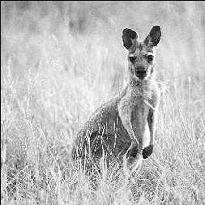
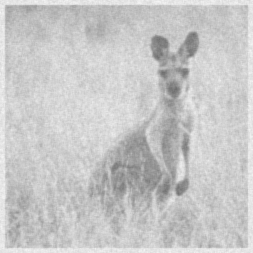
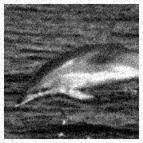
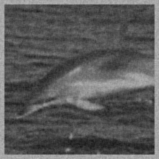
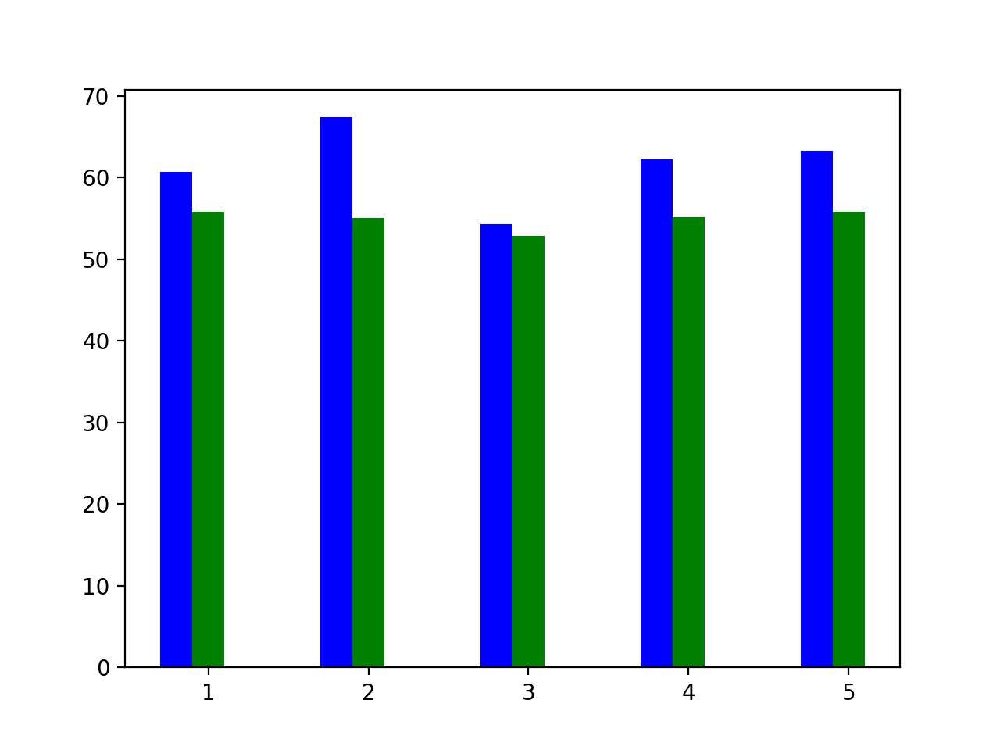

# Image Restoration using a Wiener Filter

An implementation of the following paper 

**Furuya, Hiroko et al. “Image Restoration via Wiener Filtering in the Frequency Domain.” (2009).**

Using A variant of a Wiener filter as an Image restoration technique for Gaussian and Defocus Blur. 

## Wiener Filter

Wiener filter is a signal filter which tries to minimze the mean square error between the input image and the output image. Thus given an image with blur and noise added, we can create a filter which restores the image. In order to achieve this, the impulse response of the filter must be equal to 

    W = H`/(|H|^2 + |N|^2/|F|^2)

where 
- H is the impulse response in the fourier domain
- N is the Power Spectral Density of the input signal 
- F is the Power Spectral Density of the Noise function
- |N|^2/|F|^2 = k

However given we don't we have the input image and the noise function. We thus estimate the value of k and apply that to our weiner filter.

Our model works on two optimization methods for k.

#### Example - 1

<p float="left" align="center">
  
  
  
</p>

#### Example - 2

<p float="left" align="center">
  
  
  
</p>

<br><br>

<p align="center">

</p>

WE thus compare our metric scores of our optimization techniques, over a set of images. The blue graph is Opt-1 and the green graph is Opt-2. More details about the optimization techniques in the [report](REPORT.md)

## Development and Running

In order to run the following program 


```bash
# Clone this repository
git clone https://github.com/sahitpj/Wiener-Filter/

# Go into the repository
cd Wiener-Filet

# Install dependencies
pip install -r requirements.txt

# Run the app
python main.py <path to image>
```


dataset credits - http://www.vision.caltech.edu/Image_Datasets/Caltech101/Caltech101.html