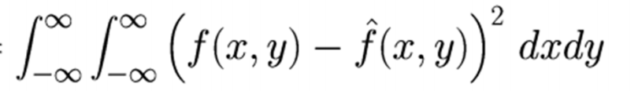

# Report 
In the following model we demonstrate the weiner filter and an algorithm to help optimize parameters taken while constructing the weiner filter (best viewed on https://github.com/sahitpj/Wiener-Filter/blob/master/REPORT.md)

**by - Jayakrishna Sahit (16110104)**

## Wiener Filter

Wiener filter is a signal filter which tries to minimze the mean square error between the input image and the output image. Thus given an image with blur and noise added, we can create a filter which restores the image. Thus considering the mean square minimization 



simplifying the following equation in terms of Values we know, we get the following 

    W = H`/(|H|^2 + |N|^2/|F|^2)

where 
- H is the impulse response in the fourier domain
- N is the Power Spectral Density of the input signal 
- F is the Power Spectral Density of the Noise function

However given we don't we have the input image and the noise function, we require an estimate for **N** and **F** , thus in our given formula we substitute 

    |N|^2/|F|^2 = k

Thus our task now is to find the optimum **k** value for a general the filter we have produced. 

In order to that, we first define our metric. We define the **SNR Improvement** as the following 

    Spectral Density of input noise / Spectral Density of Output noise

Where input noise is simply and the mod difference of the corrupted image and the input image and the output noise is the mod difference between the corrupted image and restored image


#### Optimisation-1

In the first optimization we assume k to be a scalar vector. We then vary the value of k, and find the optimum value for our training set. 

We then apply the following k for all other images.

```python
def optimize_1(imagepath_list):
    k_list = []
    for imagepath in imagepath_list:
        k_values = np.linspace(0, 0.2, num=20)
        scores = []
        l = 0
        best_k = 0
        for i in xrange(len(k_values)):
            score = process(imagepath, k_values[i])
            scores.append(score)
            if score > l:
                l = score
                best_k = k_values[i]
            print 1
        # plt.plot(k_values, scores)
        # plt.show()
        # print 'best k value  - ', best_k
        k_list.append(best_k)
    return sum(k_list)/len(k_list)
```

The short coming for this optimization is that we are assuming a constant values for all values of the k-matrix

#### Optimization-2

In the second optimization, given our training set, we find the value optimum value of k, assuming that we have the power spectral density of the input image, along with that of the noise. 

We then average this value and take this as our general

```python
def optimize_2(kernel_size, imagepath_list):
    threshold = 40
    k_values = []
    for imagepath in imagepath_list:
        im = cv2.imread(imagepath, 0)[:101, :101] #to produe k of 101x101
        noise = gaussianNoise(im, 20)
        k = Find_k(im, noise)
        if process_2(imagepath, k) > threshold:
            k_values.append(k)
    return sum(k_values)/len(k_values)
```

The short coming for this, is that we are using input image and noise data. However by using a large number of images, this value of k can be genralised for all images, and can be used as a general k.


Thus comparing our optimization techniques we get the following graph 


The Blue graph represents Optimization-1 and the Green Graph Optimization-2

The first 2 images are images similar to the ones we have used to train for k values, while the last 3 are different images.

## Conclusion

Although we can observe that Opt-1 is greater than Opt-2, we can see that Opt-2 is not far behind and can be applied to all images. Thus the need to randomly find the value of k, is not necessary which may take time and more computational power when dealing with large images and datasets.


